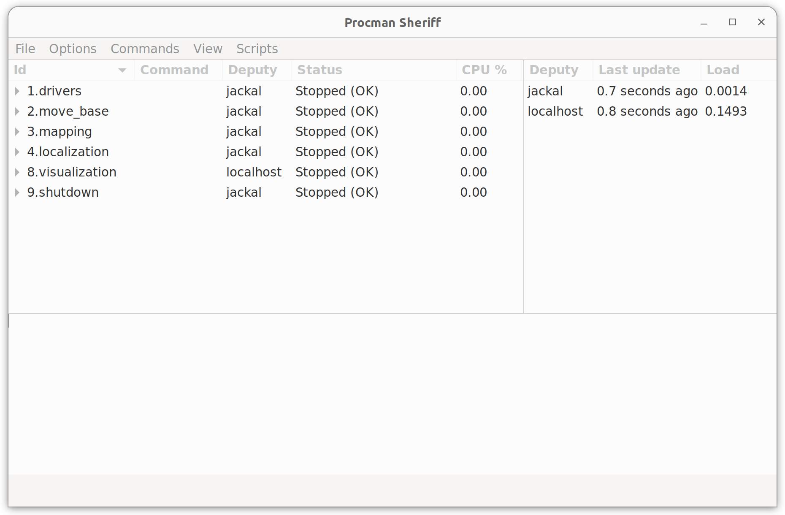

# AutoInspect Jackal companion workspace

Author: [Tobit Flatscher](https://github.com/2b-t) (2025)


## 0. Overview

This repository contains a **workspace** for working with the [**Clearpath Jackal UGV**](https://clearpathrobotics.com/jackal-small-unmanned-ground-vehicle/) robot.


## 1. Set-up

Install dependencies 


## 2. Running

Proceed to **build the workspace** and source it

```bash
$ catkin build
```

Run procman specifying the corresponding configuration file as follows:

```bash
$ source devel/setup.bash
$ rosrun procman_ros sheriff -l src/autoinspect_jackal/autoinspect_jackal_bringup/config/procman/jackal.pmd
```

If everything worked out correctly you should be able to see both deputies, your PC (`localhost`) as well as the Jackal online and updating regularly, like shown in the top right of the screenshot below.



From here you can start and stop individual launch files from the given list, run scripts that coordinate the start-up of several launch files and monitor their status.
