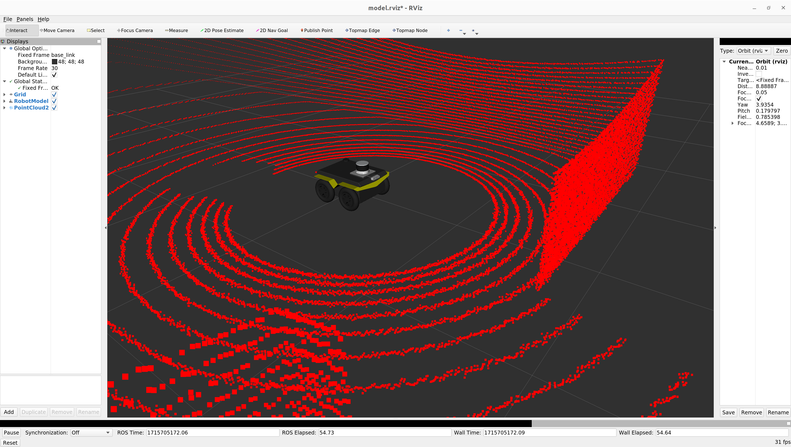

# AutoInspect Jackal

Author: [Tobit Flatscher](https://github.com/2b-t) (2024)


## Overview

This repository contains packages with URDFs, runtime configurations and maps for the [**Clearpath Jackal**](https://clearpathrobotics.com/jackal-small-unmanned-ground-vehicle/) in combination with the AutoInspect toolchain, the **DRS Frontier mapping device** and **GOALS topological navigation**.


## Installation

For a ROS workspace that contains most of the dependencies like Vilens and Topological Navigation please refer to [the Frontier Husky workspace](https://github.com/ori-drs/frontier_husky_ws) and install the additional dependencies for the Jackal itself:

```bash
$ sudo apt-get install ros-noetic-jackal-control ros-noetic-jackal-description ros-noetic-jackal-desktop ros-noetic-jackal-gazebo ros-noetic-jackal-msgs ros-noetic-jackal-navigation ros-noetic-jackal-simulator ros-noetic-jackal-viz
```


## Usage

For information on running this software stack please refer to the individual read-mes of the underlying packages.


