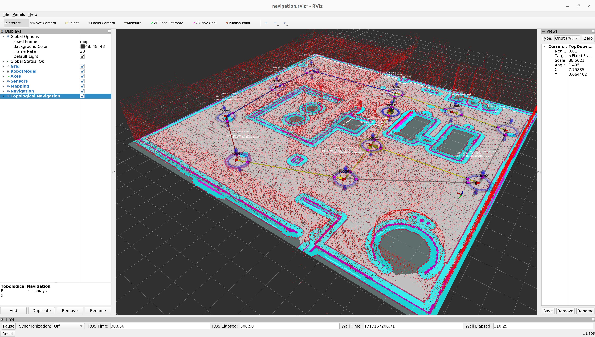
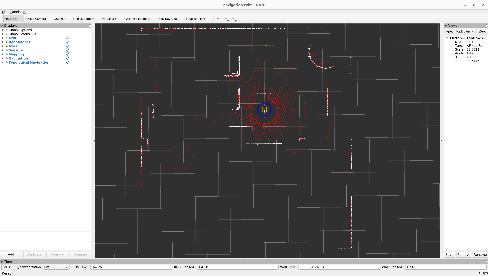
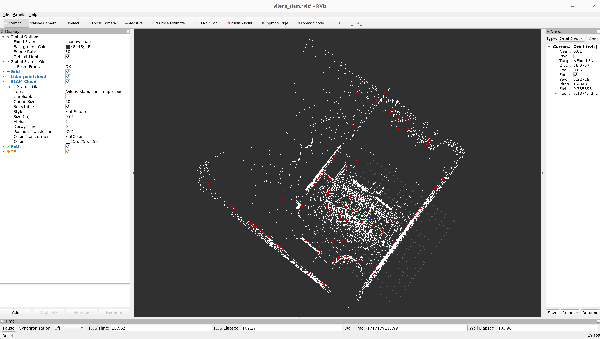
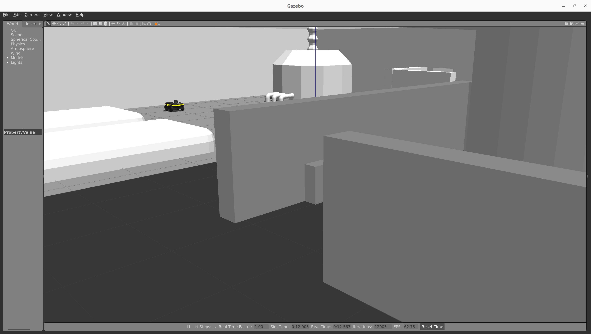
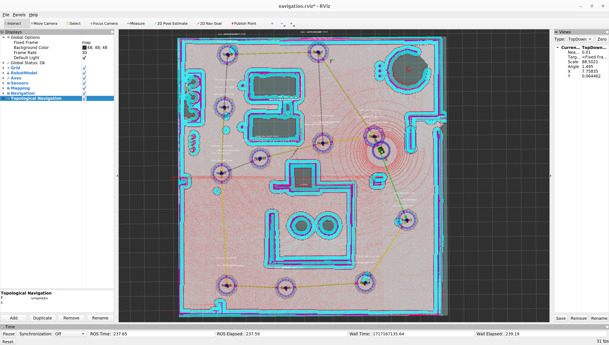

# AutoInspect Jackal bring-up

Author: [Tobit Flatscher](https://github.com/2b-t) (2024)


## Overview

This package contains configuration files for running the **AutoInspect Jackal**. The software stack is based around [Vilens and Vilens SLAM](https://github.com/ori-drs/vilens) for map building, [ICP odometry](https://github.com/ori-drs/vilens) for localization, the [ROS Navigation stack](http://wiki.ros.org/navigation) for navigation as well as [Topological Navigation](https://github.com/ori-goals/ori_topological_navigation) for navigation and mission planning.




## Usage

There are two modes that this software stack can be run in: **SLAM** for building a map and **navigation** for localizing in the resulting map. Furthermore you can run it in simulation mode as well as with the real robot.


### Mapping

As a first step we will have to run the system in mapping mode. In this mode we will **create a new map of the environment** by running **Vilens and Vilens SLAM**. By default this map is created inside `~/vilens_slam_data/` with the symbolic link `~/vilens_slam_data/online_slam_output/` pointing to the latest output folder. For this we will **run the Jackal in mapping mode**. The two arguments `map` and `topo_map` are just there to make sure that the existing map is not loaded which might be slightly confusing.

```bash
$ roslaunch autoinspect_jackal_bringup jackal_or_reactor_room.launch map:="-" topo_map:="-"
```

Then launch the SLAM tool-chain with:

```bash
$ roslaunch autoinspect_jackal_bringup slam.launch
```

Now use the interactive marker to **drive the robot around** and record a map of the environment. Be sure to drive slowly: The Jackal is able to accelerate very fast and accelerations of the same order of magnitude as gravity might lead to the mapping tool-chain breaking down.

Once you are done with mapping, run the following command to save the map:

```bash
$ rosservice call /vilens_slam/write_complete_map "{}"
```

This will save a file `combined_cloud.ply` inside the folder above that can be used by ICP for localization.

Then **convert the SLAM graph to a topological map** by running:

```bash
$ rosrun spot_runtime_drs autonomy_config.py generate
```

|  |  |
| ------------------------------------------------------------ | ------------------------------------------------------------ |
| RViz visualization for controlling the Jackal during map building | RViz visualization during map building with Vilens and Vilens SLAM |


### Navigation

For launching **navigation** inside **simulation** first bring up the simulation environment and navigation

```bash
$ roslaunch autoinspect_jackal_bringup jackal_or_reactor_room.launch
```

Then continue to launch the localization tool-chain. For **localization with ICP** run the following launch file providing the map of interest:

```bash
$ roslaunch autoinspect_jackal_bringup icp_localization.launch map:="/path/to/combined_cloud.ply"
```

You might not see the map that ICP localization is localizing against. For republishing it, call the following service:

```bash
$ rosservice call /icp_odometry/publish_prior_map "{}"
```

You can now command the robot around with the topological navigation nodes as well as with a standard 2D navigation goal. For the latter be sure to viewing RViz in the `map` frame as goals to the navigation stack should be sent in that frame. In case you have trouble interacting with the topological nodes try to not visualize the `Navigation` group inside RViz.

|  |  |
| ------------------------------------------------------------ | ------------------------------------------------------------ |
| Gazebo simulation of the AutoInspect Jackal                  | RViz visualization of the AutoInspect Jackal in navigation mode |

