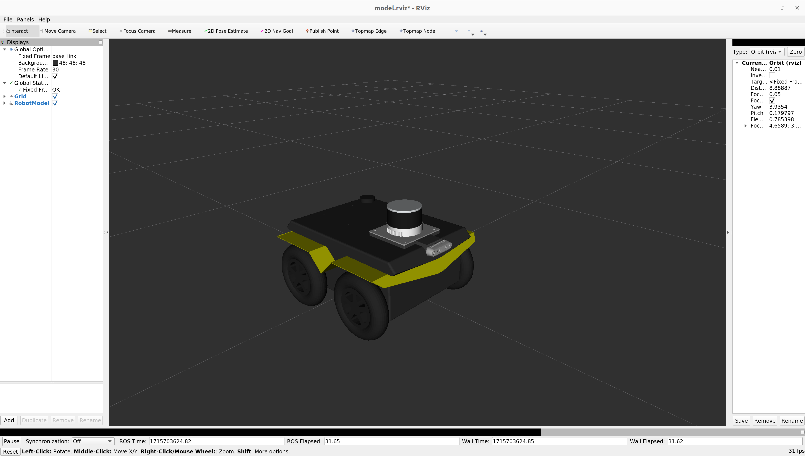

# AutoInspect Jackal description

Author: [Tobit Flatscher](https://github.com/2b-t) (2024)


## Overview

For visualizing the URDF run

```bash
$ roslaunch autoinspect_jackal_description view_model.launch
```

This should show the AutoInspect Jackal inside RViz as shown below. Alternatively you can also export the payload with `$ export JACKAL_URDF_EXTRAS=$(rospack find autoinspect_jackal_description)/urdf/extras.urdf.xacro` and then load the description with the official launch file `$ roslaunch jackal_description description.launch`.


